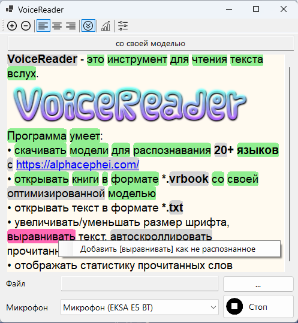

# VoiceReader
**VoiceReader** - это инструмент для чтения текста вслух.

Программа умеет:
* скачивать модели для распознавания **20+ языков** c [https://alphacephei.com/](https://alphacephei.com/)
* открывать книги в формате **\*.vrbook**
* открывать текст в формате **\*.txt**
* увеличивать/уменьшать размер шрифта, выравнивать текст, автоскроллировать прочитанный текст
* отображать статистику прочитанных слов

